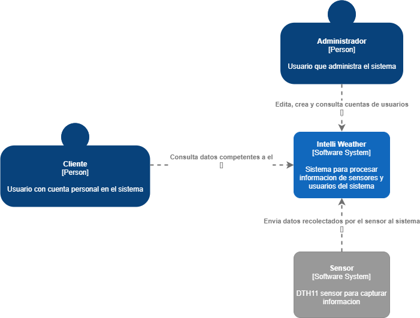
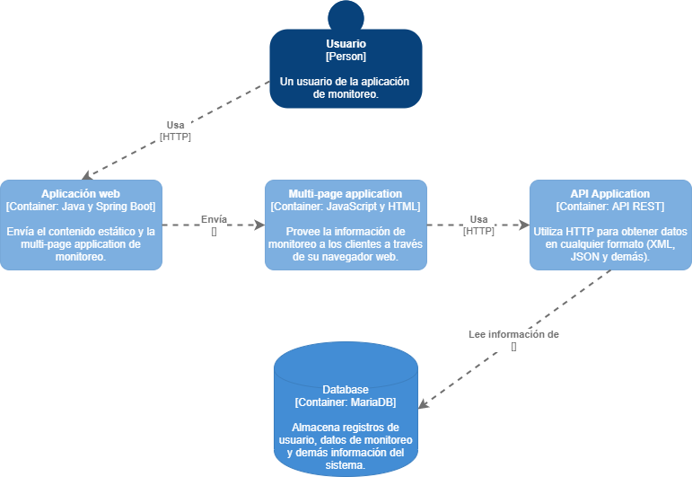
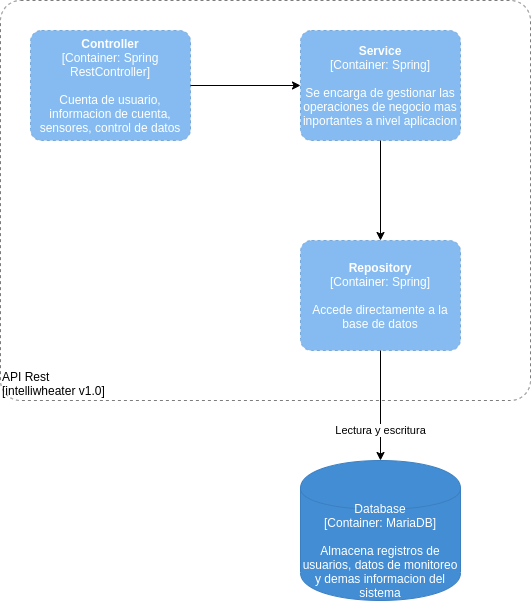
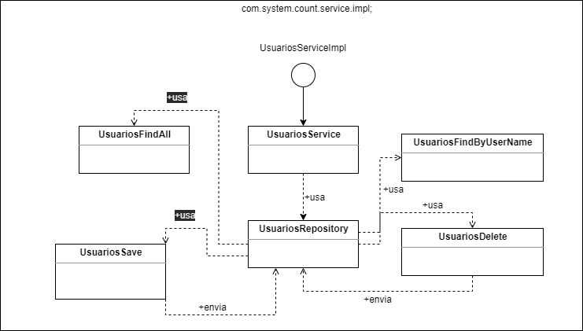

# Introducción

## :trophy: A3.1 Actividad de aprendizaje

Diseño de arquitectura de software utilizando modelo C4

### :blue_book: Instrucciones

- Basado en una investigación y en el documento proporcionado, realizar el modelo de arquitectura C4 para el caso de estudio, integrando los diagramas de contexto, contenedor y componentes.
- El documento deberá contener el caso de estudio, y el diagrama ilustrado se deberá elaborar con una herramienta UML como puede ser [plantUML](https://github.com/LeonardoEnriquez/plantuml-1) **utilizando VSCode** o **drawio**.
- Toda actividad o reto se deberá realizar utilizando el estilo **MarkDown con extension .md** y el entorno de desarrollo VSCode, debiendo ser elaborado como un documento **single page**, es decir si el documento cuanta con imágenes, enlaces o cualquier documento externo debe ser accedido desde etiquetas y enlaces, y debe ser nombrado con la nomenclatura **A3.1_NombreApellido_Equipo.pdf.**
- Es requisito que el .MD contenga una etiqueta del enlace al repositorio de su documento en GITHUB, por ejemplo **Enlace a mi GitHub** y al concluir el reto se deberá subir a github.
- Desde el archivo **.md** exporte un archivo **.pdf** que deberá subirse a classroom dentro de su apartado correspondiente, sirviendo como evidencia de su entrega, ya que siendo la plataforma **oficial** aquí se recibirá la calificación de su actividad.
- Considerando que el archivo .PDF, el cual fue obtenido desde archivo .MD, ambos deben ser idénticos.
- Su repositorio ademas de que debe contar con un archivo **readme**.md dentro de su directorio raíz, con la información como datos del estudiante, equipo de trabajo, materia, carrera, datos del asesor, e incluso logotipo o imágenes, debe tener un apartado de contenidos o indice, los cuales realmente son ligas o **enlaces a sus documentos .md**, _evite utilizar texto_ para indicar enlaces internos o externo.
- Se propone una estructura tal como esta indicada abajo, sin embargo puede utilizarse cualquier otra que le apoye para organizar su repositorio.

``` 
| readme.md
| | blog
| | | C3.1_NombredelaActividad.md
| | | C3.2_NombredelaActividad.md
| | | C3.3_NombredelaActividad.md
| | img
| | docs
| | | A3.1_NombredelaActividad.md
| | | A3.2_NombredelaActividad.md
| | | A3.3_NombredelaActividad.md
```

### :pencil2: Desarrollo

1. Incluyese los siguientes diagramas dentro de este apartado, considere que estos serán utilizados posteriormente.


   - [x] 1. Diagrama de contexto.



   - [x] 2. Diagrama de contenedores.

 

   - [x] 3. Diagrama de componentes.
  
 

   - [x] 4. Diagrama de clases

 


#### :book: Conclusiones

***Cristian Escobedo***

El realizar la actividad hizo que pueda aprender mas y el cómo implementar el modelo C4 para las cuatro diferentes facetas de arquitectura del software a desarrollar, el cómo se profundiza conforme se realiza un diagrama tras otro y su misma relacion entre ellos para expresar el funcionamiento interno del sistema. 

***Emmanuel Frias***

El modelo C4 me resulto muy interesante para trabajar, ya que no hay que realizar demasiados diagramas, con solo 4 se representa correctamente lo que se busca hacer. Desafortunadamente no hay tanta información sobre el tema como la que se encuentra sobre UML

***Eduardo Collazo Rivera*** 

De acuerdo a la actividad la desarrollamos utilizando el modelo C4 para definir el funcionamento interno del sistemaa basandonos en 4 distintos diagramas los cuales tenian una relacion entre ellos, tambien se definen que tecnologias se van a utilizar o  servicios que se deben implementar.

***Manuel Bamaca Trujillo*** 

Es un modo de trabajo diferente a los utilizados utilizando distintas formas de diagramas, a diferencia de otros modelos se reduce a 4 diagramas para representar el proyecto que se esta realizando, esto haciendo que sea mas entendible para desarrollarlo, al investigar mas a fondo con documentación y en otras fuentes es entendible de realizar.

***Duran Trejo***

El modelo C4 y los diagramas desarrollados desde la perspectiva de un cliente fueron sumamente útiles para definir y esclarecer el trabajo a desarrollar, junto con las herramientas y secciones conceptualizadas inicialmente.

***Tania Osuna***

Todas las actividades para diagramar vistas previamente sirvieron como base para desarrollar fácilmente el modelo C4. Definitivamente todo lo visto con anterioridad ayudó para que tomara forma lo que se vio en la actividad actual

#### :bomb: Rubrica

| Criterios     | Descripción                                                                                  | Puntaje |
| ------------- | -------------------------------------------------------------------------------------------- | ------- |
| Instrucciones | Se cumple con cada uno de los puntos indicados dentro del apartado Instrucciones?            | 10      |  | 5 |
| Desarrollo    | Se respondió a cada uno de los puntos solicitados dentro del desarrollo de la actividad?     | 60      |
| Demostración  | El alumno se presenta durante la explicación de la funcionalidad de la actividad?            | 20      |
| Conclusiones  | Se incluye una opinión personal de la actividad  por cada uno de los integrantes del equipo? | 10      |

:house: [Ir a metodología ágil](../docs/D3.0_MetodologiaAgil.md)